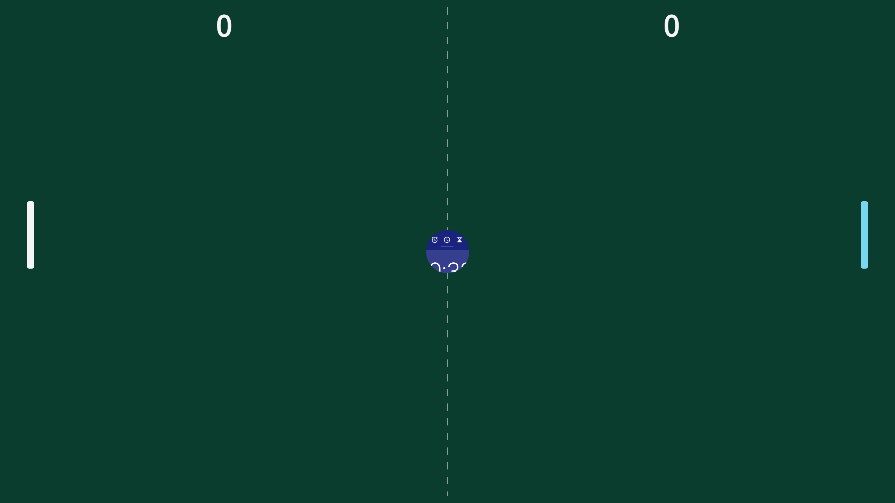

# CarSystemUI PingPong

Ping-pong played with Scalable UI panels on Android Automotive. The court and the paddles are
`DecorPanel`s, the ball is a `TaskPanel` with a real app flying inside it (the desk clock), and
one paddle is played by [Jev](https://typesafe.ai), TypeSafe's System One model: asked as a
typed choice where the ball will cross its line, it drives the paddle there. The other paddle
follows your finger.



A **pod**: an `android_library` wired into `CarSystemUI` through Dagger, using only Scalable
UI's public controller surface: no reflection, no changes to `car-scalable-ui-lib` or
`car-wm-shell-lib`.

## How it works

- **Per frame, same size, new origin**, like the [Win98 pod](https://github.com/passenger6/car-systemui-win98-pod)
  drags a window: the pod stamps the panel's current variant and moves its surface in one
  `AutoSurfaceTransaction`. No `WindowContainerTransaction`, so the app in the ball never
  relayouts. The loop is a `Choreographer` callback on the shell main thread; paddle hits are
  swept, so a fast ball cannot skip a paddle.
- **The XML owns the states.** The pod fires events and reads the ball's variant back; what the
  panels do is drawn in the editor:

  | The pod | The XML |
  |---|---|
  | flies the ball while its variant is `in_play` | a variant named `in_play` |
  | fires `_Pong_Serve` when the ball rests | `idle → in_play` |
  | fires `_Pong_Point_left` / `_right` on a goal | `in_play → idle` (a duration glides the ball home) |
  | fires `_Pong_Win_left` / `_right` at the winning score, once the ball rests | anything; the sample swells the ball and sends the loser off court |

- Left and right are read off the paddles' positions; `string/pong_jev_paddle` picks Jev's.
  A paddle is either a drawn bar or an app (`PongPaddleTaskController`); an app paddle is
  steered by touching your half of the court.

## Sample RRO

`samples/PingPongRRO`: open it in the Scalable UI Editor and reshape it, or build it as is:
the court, the ball, two paddles, plus the DEWD reference layout's navigation bars and app
grid so the emulator stays usable. The ball's app is `string/pong_ball_component`.

## Install

Tested on `aosp-17_r1`, lunch target `sdk_car_dewd_x86_64-cp2a-userdebug` (DEWD ships Scalable
UI with `enable_ext_panel_updates` on; the plain car target does not).

Two edits in `packages/apps/Car/SystemUI`, then `m CarSystemUI PingPongRRO`.

1. Clone into the pods directory:

   ```
   git clone https://github.com/passenger6/car-systemui-pingpong-pod.git \
       packages/apps/Car/SystemUI/pods/pingpong
   ```

2. Register the library in `Android.bp`:

   ```diff
    carsysui_pods = [
   +    "CarSystemUI-PingPong",
   ```

3. Include the Dagger module in
   `src/com/android/systemui/car/wm/scalableui/panel/controller/PanelControllerModule.java`:

   ```diff
   +import com.android.systemui.car.pingpong.PongPanelModule;

   -@Module(includes = { MinimizedControlsPanelModule.class })
   +@Module(includes = { MinimizedControlsPanelModule.class, PongPanelModule.class })
   ```

   If other pods are already listed there (Win98, FocusGlow), keep them and append
   `PongPanelModule.class`.

4. Build and run:

   ```
   source build/envsetup.sh
   lunch sdk_car_dewd_x86_64-cp2a-userdebug
   m CarSystemUI PingPongRRO
   emulator -gpu host -cores 3 -memory 6096 -no-snapshot-save -writable-system
   ```

   With `-writable-system`, a rebuilt CarSystemUI and RRO go on with
   `adb root && adb remount && adb sync` instead of a reflash.

5. Enable the overlay for the current user and restart SystemUI (overlays are per user; a
   toggle alone does not reload panel XML):

   ```
   adb shell cmd overlay enable --user $(adb shell am get-current-user) com.android.systemui.rro.pingpong
   adb root && adb shell pkill -f com.android.systemui
   ```

Nothing else is needed: every part of the game is created from the RRO's panel XML, so there
is no pool to expose and no initializer to touch (unlike the Win98 pod's steps 4 and 5).

## Jev's key

Read on every question, no restart needed. Preferred: a root-only file in SystemUI's
device-protected storage:

```
adb root
adb push key.txt /data/user_de/0/com.android.systemui/files/pong_jev_api_key
adb shell chown system:system /data/user_de/0/com.android.systemui/files/pong_jev_api_key
adb shell chmod 600 /data/user_de/0/com.android.systemui/files/pong_jev_api_key
```

Fallback: `adb shell settings put global pong_jev_api_key <key>`, readable by every app and
in every bugreport, so only with a throwaway key. Keys: https://console.typesafe.ai/keys.
Without a key the court says so and Jev's paddle stays put. Only `https` endpoints are called.

## Configure

Every value is an overridable resource in `res/values/` (read once per SystemUI process,
coerced into a playable range). The ones you are likely to touch:

| Resource | Default |
|---|---|
| `string/pong_jev_paddle` | `pong_right_paddle` |
| `string/pong_ball_component` | the desk clock |
| `integer/pong_ball_speed_dp` / `pong_ball_max_speed_dp` | 600 / 1600 |
| `integer/pong_serve_delay_ms` | 1200 (2200 in the sample) |
| `integer/pong_win_score` | 11 |
| `integer/pong_lanes` | 12 (bands Jev answers in) |

## Tests and logs

```
atest CarSystemUI-PingPong-tests
adb logcat -s PongGame PongMatch
```

The tests cover the pure parts: physics, score, paddle drive, Jev's question and brain, config
ranges.

## Known limits

- Jev decides in bands, not pixels (`pong_lanes`).
- The ball is a task: its app still receives touches while it flies.
- Touch only; nothing is reachable with the rotary controller.
- Speeds use the density of SystemUI's default display.

## License

Apache 2.0, see [LICENSE](LICENSE). Copyright 2026 Daniel Georg. The sample's `left.xml`,
`right.xml`, `app_grid_panel.xml` and `app_grid_panel_controller.xml` are derived from the AOSP
CarSystemUI samples and keep their header.
